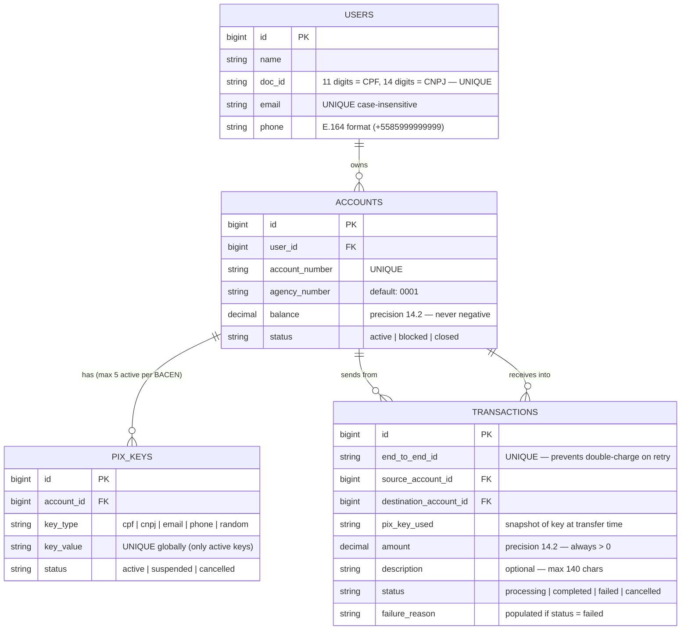

# 🗄️ Database Design — PIX System
> Based on BACEN Official Specification: github.com/bacen/pix-dict-api & github.com/bacen/pix-api

---

## 📐 Logic Diagram (ERD)



---

## ⚠️ Key Design Decisions

### Money: NEVER use `float`. Always use `decimal(14, 2)`.
Float causes binary rounding errors in financial calculations. `decimal` is exact.

### `tax_id_type` is NOT needed — it is implicit from length.
- 11 digits → CPF → validate using modulo-11 check digit algorithm
- 14 digits → CNPJ → validate using CNPJ-specific weight algorithm
- Any other length → invalid

### PIX Key uniqueness is GLOBAL and PARTIAL
- A key can only belong to ONE active account across the entire system.
- Enforced via a partial unique index: `UNIQUE WHERE status = 'active'`
- This allows a cancelled key to be re-registered later.

### Max 5 active PIX keys per account (BACEN rule)
Enforced at the application/model layer before creation.

### CPF key must match the account owner's tax_id (BACEN rule)
You cannot register another person's CPF as your own PIX key.

### Phone must be stored in E.164 format (BACEN rule)
Store as `+5585999999999`, never as `(85) 99999-9999`.

### `end_to_end_id` guarantees idempotency
If a network timeout causes the client to retry a transfer request, the second request
finds the existing `end_to_end_id` and does NOT double-charge the sender.

### Blocked accounts CAN receive, but CANNOT send (BACEN rule)
Closed accounts can neither send nor receive.

### Self-transfers are blocked at database level
`CHECK (source_account_id <> destination_account_id)`

---

## 🔄 Migration Order (Dependency Chain)

```
1. create_users            (no dependencies)
2. create_accounts         (depends on: users)
3. create_pix_keys         (depends on: accounts)
4. create_transactions     (depends on: accounts x2)
```

Each developer must merge their migration in this order to avoid foreign key errors!
