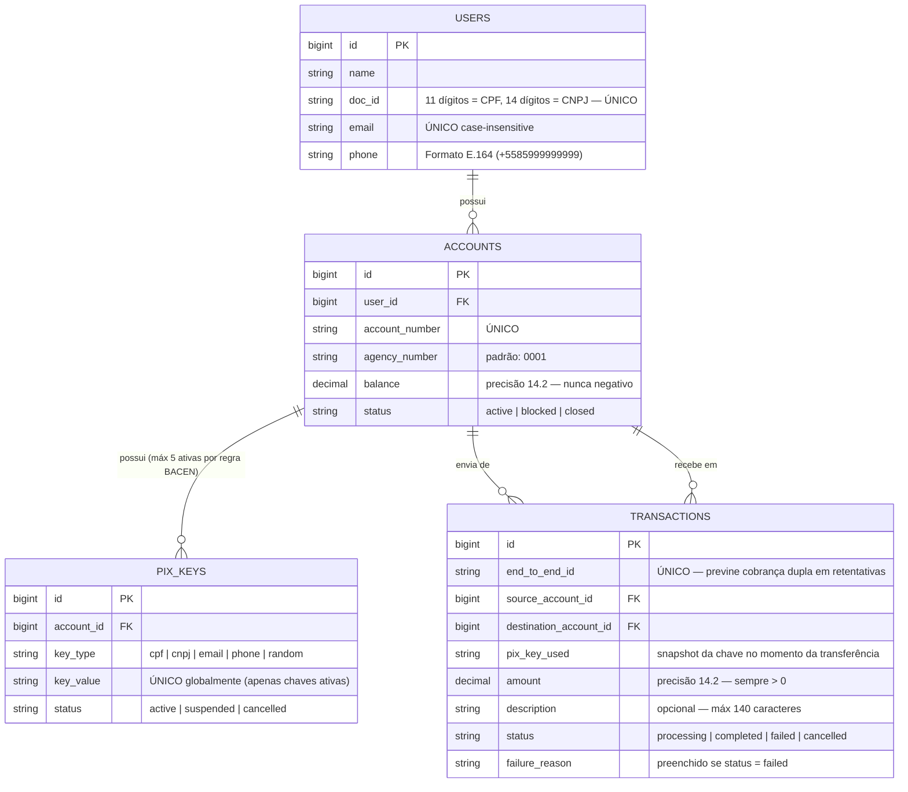

# 🗄️ Modelagem do Banco de Dados — Sistema PIX
> Baseado na Especificação Oficial do BACEN: github.com/bacen/pix-dict-api & github.com/bacen/pix-api

---

## 📐 Diagrama Lógico (DER)



---

## ⚠️ Decisões Principais de Projeto

### Dinheiro: NUNCA use `float`. Use sempre `decimal(14, 2)`.
Ponto flutuante (float) causa erros de arredondamento binário em cálculos financeiros. `decimal` é exato.

### `tax_id_type` NÃO é necessário — é implícito pelo tamanho.
- 11 dígitos → CPF → validar usando o algoritmo de dígito verificador módulo-11
- 14 dígitos → CNPJ → validar usando o algoritmo de pesos específico do CNPJ
- Qualquer outro tamanho → inválido

### Unicidade da Chave PIX é GLOBAL e PARCIAL
- Uma chave só pode pertencer a UMA conta ativa em todo o sistema.
- Garantido via índice único parcial: `UNIQUE WHERE status = 'active'`
- Isso permite que uma chave cancelada seja recadastrada posteriormente.

### Máximo de 5 chaves PIX ativas por conta (regra BACEN)
Garantido na camada de aplicação/modelo antes da criação.

### Chave CPF deve pertencer ao titular da conta (regra BACEN)
Você não pode cadastrar o CPF de outra pessoa como sua chave PIX.

### Telefone deve ser armazenado no formato E.164 (regra BACEN)
Armazene como `+5585999999999`, nunca como `(85) 99999-9999`.

### `end_to_end_id` garante idempotência
Se um timeout de rede fizer o cliente retestar uma requisição de transferência, a segunda requisição encontra o `end_to_end_id` existente e NÃO cobra o remetente duas vezes.

### Contas bloqueadas PODEM receber, mas NÃO PODEM enviar (regra BACEN)
Contas encerradas não podem enviar nem receber.

### Auto-transferências são bloqueadas no nível do banco de dados
`CHECK (source_account_id <> destination_account_id)`

---

## 🔄 Ordem de Migração (Cadeia de Dependências)

```
1. create_users            (sem dependências)
2. create_accounts         (depende de: users)
3. create_pix_keys         (depende de: accounts)
4. create_transactions     (depende de: accounts x2)
```

Cada desenvolvedor deve realizar o merge de sua migração nesta ordem para evitar erros de chave estrangeira (foreign key)!
